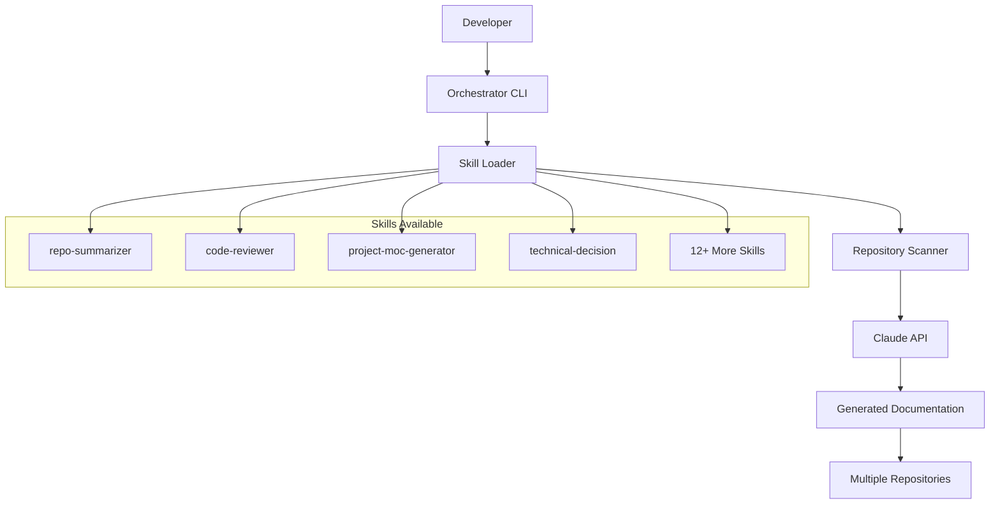
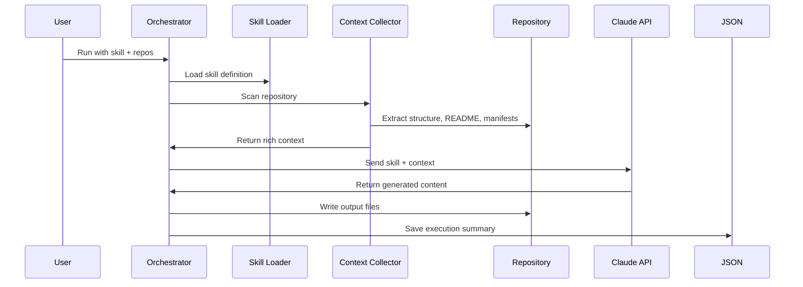

# Orchestrator Project MOC

Welcome to the comprehensive Map of Content for the **Generic Orchestrator for Claude Skills** - a flexible Python automation tool that runs any skill from your Claude toolkit against multiple local repositories.

## Quick Navigation

- [Features](./features.md) - Implemented capabilities and feature catalog
- [Architecture](./architecture.md) - System design and technical decisions  
- [Components](./components.md) - Detailed component documentation
- [Decision History](./decisions.md) - Architectural decisions and rationale

## Project Overview

The orchestrator is a **skill-agnostic execution engine** that bridges Claude AI capabilities with local repository analysis. It transforms the challenge of maintaining documentation across multiple repositories into an automated workflow.

### Core Concept



### Key Capabilities

- **Universal Skill Execution**: Run any skill from your Claude toolkit
- **Batch Repository Processing**: Analyze multiple repositories in one command
- **Rich Context Collection**: Extract comprehensive repository metadata
- **Professional Output Generation**: Create portfolio-ready documentation
- **Autonomous Agent Mode**: Advanced tool-based execution with file system access

## Implementation Status

### ✅ Completed Features

| Feature | Implementation | Status |
|---------|----------------|---------|
| **Core Orchestrator** | [`orchestrator.py`](../../orchestrator.py) | Production Ready |
| **Agent Runner** | [`agent_runner.py`](../../agent_runner.py) | Advanced Mode |
| **Tool System** | [`agent_tools.py`](../../agent_tools.py) | File Operations |
| **Skill Loading** | Dynamic discovery from toolkit | Flexible |
| **Context Collection** | Repository structure + manifests | Rich |
| **CLI Interface** | Comprehensive argument parsing | User Friendly |
| **Output Management** | Per-repo files + JSON tracking | Organized |

### 🚧 Architecture Highlights

- **Dual Execution Modes**: Simple prompt-based or advanced agent-based
- **Tool-Enabled Agents**: File read/write, search, bash command execution
- **Skill Ecosystem**: Works with 12+ predefined skills
- **Production Hardening**: Error handling, timeouts, validation
- **UV Package Management**: Modern Python dependency management

## Getting Started

### Quick Start
```bash
# List available skills
uv run python orchestrator.py --list-skills

# Generate PROJECT.md files for your repos
uv run python orchestrator.py --repos /path/to/repo1 /path/to/repo2

# Run specific skill
uv run python orchestrator.py --skill code-reviewer --repos /path/to/repo
```

### Advanced Usage
```bash
# Generate complete project documentation
uv run python orchestrator.py --skill project-moc-generator --repos /path/to/repo

# Custom output filename
uv run python orchestrator.py --skill technical-decision --output decisions.md
```

## Technology Stack

- **Runtime**: Python 3.12+, UV package manager
- **AI Integration**: Anthropic Claude Sonnet 4 API
- **Dependencies**: `anthropic` SDK, `python-dotenv`
- **Architecture**: Single-file orchestrator with agent extensions
- **Configuration**: Environment-based API keys, list-based repo config

## Project Structure

```
orchestrator/
├── orchestrator.py         # Main orchestrator and CLI
├── agent_runner.py         # Agent-mode execution engine  
├── agent_tools.py          # File system tools for agents
├── test_single.py          # Single repository testing
├── pyproject.toml          # Python project configuration
├── uv.lock                 # Dependency lock file
├── README.md               # User documentation
├── PROJECT.md              # Generated portfolio documentation
├── code-review.md          # Generated code review
├── .env.example            # Environment template
└── docs/moc/               # This documentation
    ├── README.md           # This file (main entry)
    ├── features.md         # Feature catalog
    ├── architecture.md     # System design
    ├── components.md       # Component details
    └── decisions.md        # Decision history
```

## Development Workflow

### Repository Analysis Process



### Dual Execution Architecture

**Simple Mode** (Legacy):
- Single API call with repository context
- Direct output generation
- Suitable for straightforward documentation tasks

**Agent Mode** (Advanced):
- Tool-enabled autonomous agents
- Multi-iteration problem solving
- File system read/write capabilities
- Complex analysis and generation tasks

## Use Cases

### Portfolio Management
- Generate professional PROJECT.md files for multiple repositories
- Create consistent documentation across your entire codebase portfolio
- Automate technical writing for job applications and interviews

### Code Quality
- Run code reviews across your repository collection
- Generate architectural decision documentation
- Create technical spike analysis for complex features

### Documentation Automation
- Maintain up-to-date project documentation
- Generate Maps of Content for complex projects  
- Create decision histories and architectural records

## Future Vision

The orchestrator represents a foundation for **AI-powered repository management**. Future enhancements include:

- **Parallel Processing**: Concurrent repository analysis
- **Web Dashboard**: Visual results management
- **GitHub Integration**: Organization-wide repository discovery
- **Custom Templates**: Domain-specific documentation patterns
- **Incremental Updates**: Change-based re-analysis

---

**Next Steps**: Explore the detailed documentation:
- [Feature Catalog](./features.md) - What the orchestrator can do
- [Architecture Guide](./architecture.md) - How it's built
- [Component Reference](./components.md) - Implementation details
- [Decision Log](./decisions.md) - Why choices were made

*This MOC documents the orchestrator as it exists today - a production-ready tool for automating repository documentation and analysis workflows.*