# Architecture Guide

This document details the system architecture, design decisions, and technical implementation of the Generic Orchestrator for Claude Skills.

## System Overview

The orchestrator is built as a **flexible automation pipeline** that bridges human-defined skills with AI execution capabilities across multiple repositories.

### High-Level Architecture

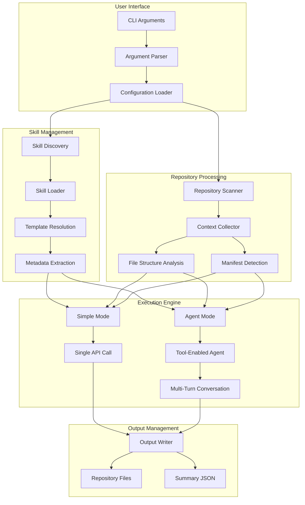

## Core Design Principles

### 1. Skill-Agnostic Execution

The orchestrator doesn't hardcode specific skills but dynamically loads them from a standardized format:

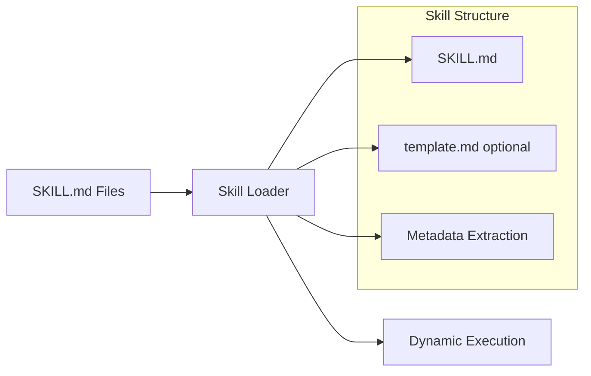

**Benefits**:
- **Extensibility**: New skills require no code changes
- **Maintainability**: Skill logic separated from execution logic
- **Flexibility**: Skills can define their own output patterns and requirements

### 2. Context-Rich Repository Analysis

The system prioritizes providing comprehensive context to AI models for better results:

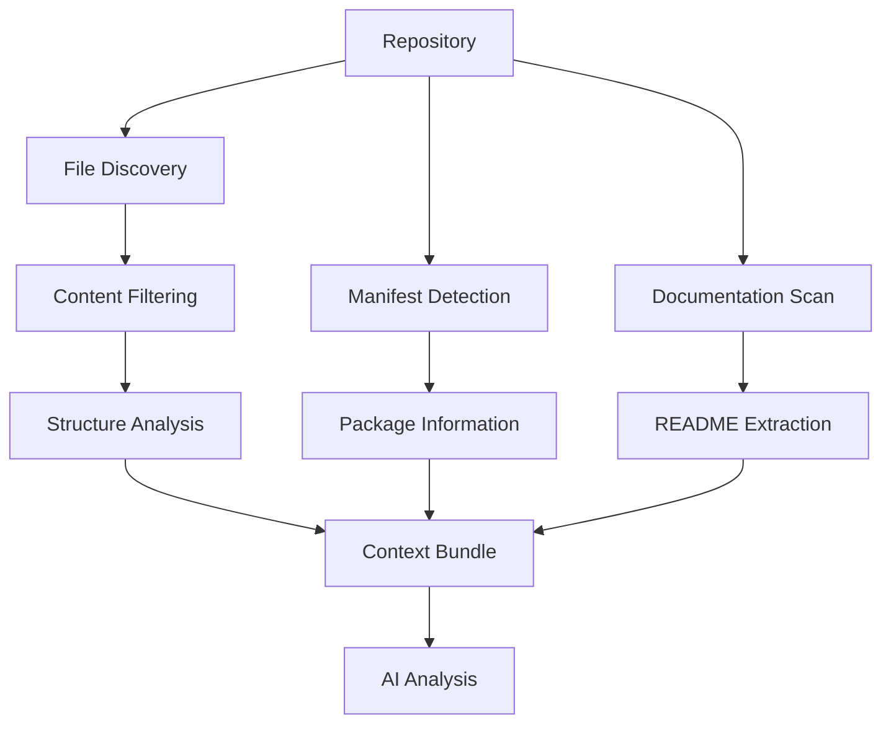

**Context Collection Strategy**:
- **Breadth**: File structure overview (up to 100 files)
- **Depth**: Important file content (README, manifests)
- **Filtering**: Exclusion of build artifacts and dependencies
- **Relevance**: Technology stack detection

### 3. Dual Execution Architecture

The orchestrator supports two execution modes for different use cases:

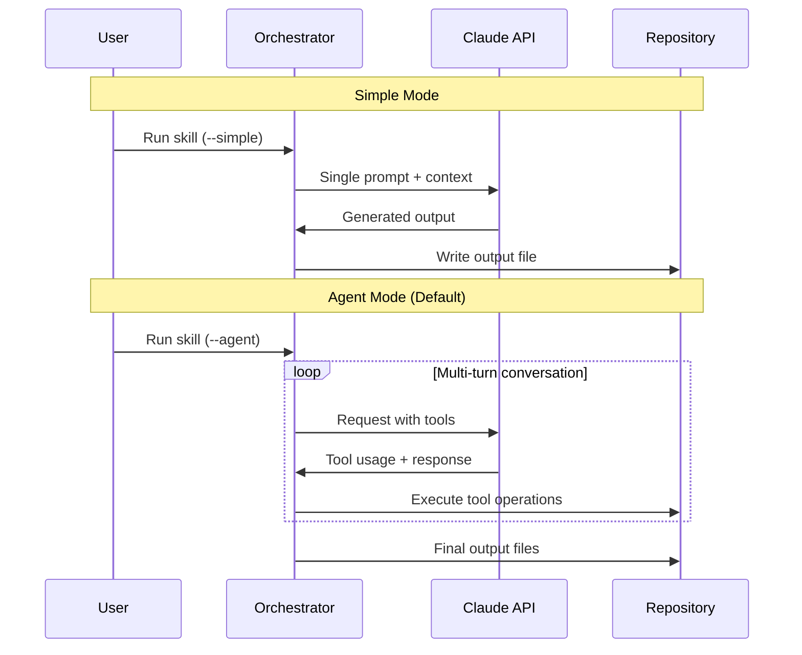

## Component Architecture

### Core Orchestrator (`orchestrator.py`)

**Responsibilities**:
- CLI interface and argument parsing
- Configuration management
- Skill discovery and loading
- Repository batch processing
- Output coordination

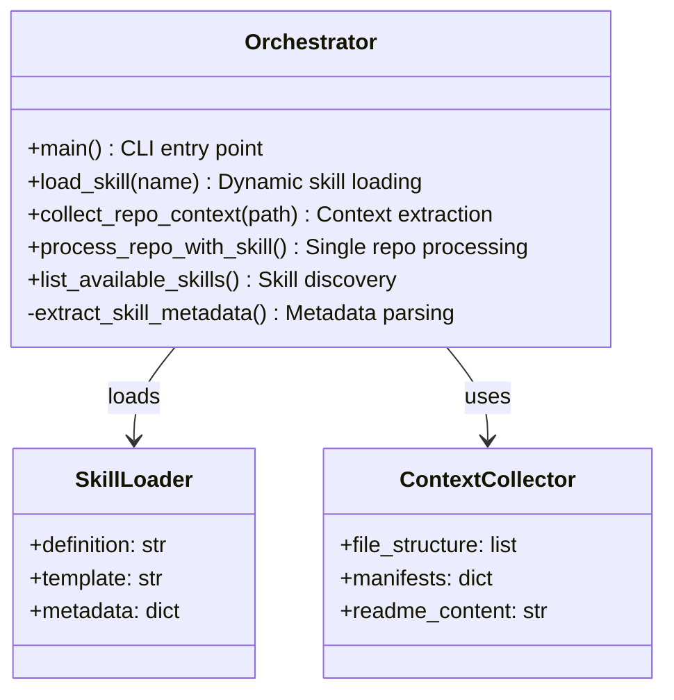

**Key Design Decisions**:

1. **Single File Design**: Everything in one file for simplicity and deployment
2. **Function-Based**: No complex OOP hierarchy, clear data flow
3. **Error Isolation**: Repository failures don't stop batch processing
4. **Configurable Paths**: Both defaults and runtime overrides

### Agent Runner (`agent_runner.py`)

**Responsibilities**:
- Multi-turn conversation management
- Tool execution coordination
- Agent state tracking
- Resource limit enforcement

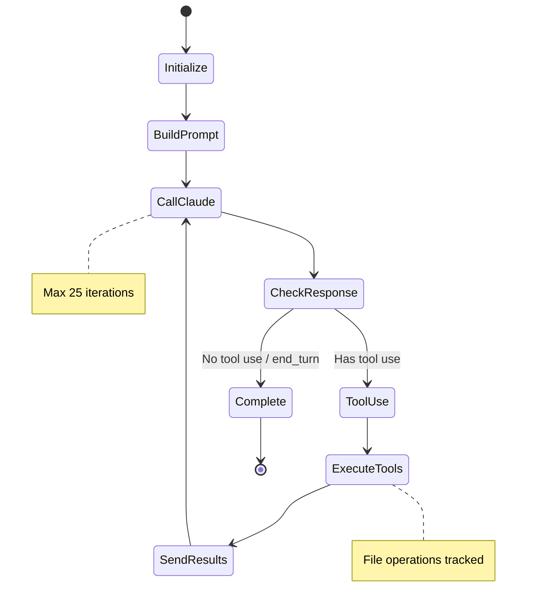

**Agent Features**:
- **Iteration Limiting**: Prevents infinite loops (max 25 turns)
- **Tool Tracking**: Complete log of all tool executions
- **File Monitoring**: Tracks created and modified files
- **Conversation History**: Full message thread preservation

### Tool System (`agent_tools.py`)

**Tool Architecture**:

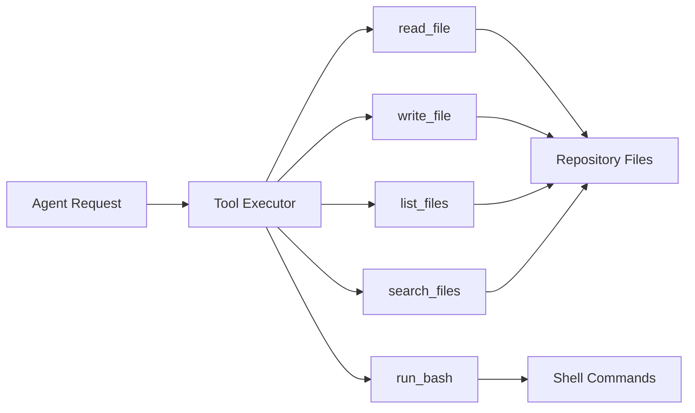

**Tool Design Principles**:
1. **Safety**: All operations scoped to repository directory
2. **Timeouts**: 30-second limit on all operations
3. **Error Handling**: Graceful failure with detailed error messages
4. **Logging**: Complete operation tracking for debugging

**Tool Implementation Example**:
```python
def _write_file(self, tool_input: Dict[str, Any]) -> Dict[str, Any]:
    file_path = self.repo_path / tool_input["path"]
    
    # Create parent directories if needed
    file_path.parent.mkdir(parents=True, exist_ok=True)
    
    try:
        with open(file_path, 'w', encoding='utf-8') as f:
            f.write(tool_input["content"])
        return {"success": True, "path": str(file_path)}
    except Exception as e:
        return {"error": f"Failed to write file: {str(e)}"}
```

## Data Flow Architecture

### Repository Processing Pipeline

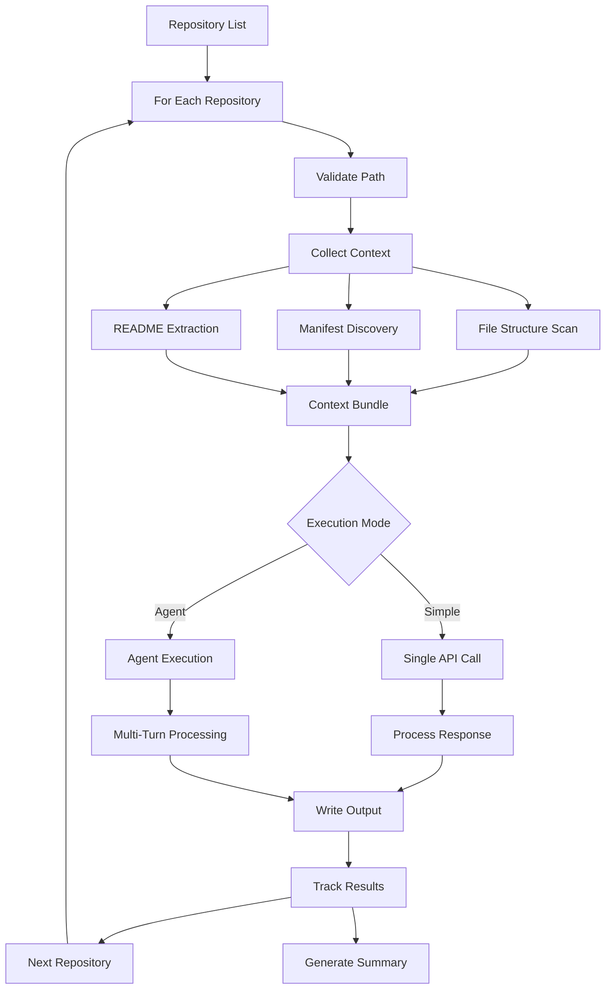

### Context Collection Strategy

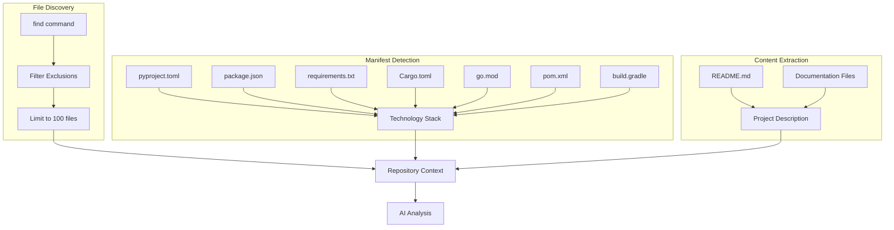

**Filtering Logic**:
```bash
# Automated exclusions
*/.*           # Hidden files and directories
*/node_modules/*   # Node.js dependencies
*/__pycache__/*    # Python cache
*/venv/*       # Virtual environments
*/.venv/*      # UV virtual environments
```

## Skill Integration Architecture

### Skill Loading Mechanism

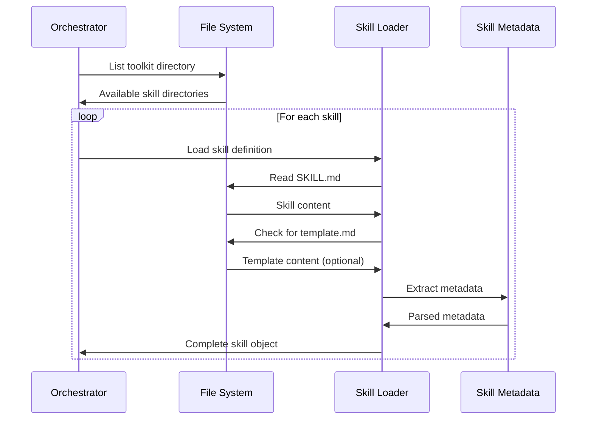

### Metadata Extraction System

The orchestrator analyzes skill definitions to determine output patterns:

```python
def extract_skill_metadata(skill_definition: str) -> dict:
    metadata = {
        "output_location": None,
        "output_filename": None, 
        "creates_directory": False
    }
    
    # Pattern matching for common outputs
    if "docs/moc/" in skill_definition.lower():
        metadata["output_location"] = "docs/moc"
        metadata["creates_directory"] = True
    
    if "project.md" in skill_definition.lower():
        metadata["output_filename"] = "PROJECT.md"
        
    return metadata
```

## API Integration Architecture

### Claude API Client Design

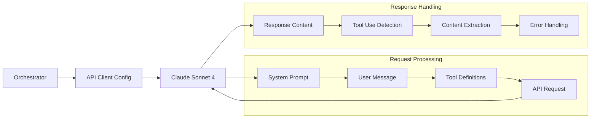

**API Configuration**:
- **Model**: `claude-sonnet-4-20250514`
- **Max Tokens**: 8000 (for comprehensive output)
- **Tool Support**: Full tool use capability in agent mode
- **System Prompts**: Skill-specific instructions

**Error Handling Strategy**:
- Network timeouts with retry logic
- Rate limiting awareness
- Token limit management
- Response validation

## Security Architecture

### File System Security

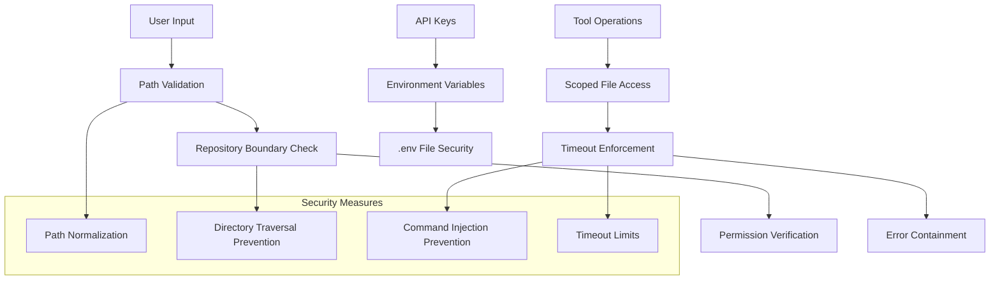

### Security Implementation

**Path Sanitization**:
```python
def validate_repo_path(path: str) -> Path:
    """Validate and sanitize repository paths."""
    normalized = Path(path).resolve()
    
    # Prevent directory traversal
    if ".." in str(normalized):
        raise ValueError("Invalid path: directory traversal detected")
    
    return normalized
```

**Command Execution Safety**:
```python
def _run_bash(self, tool_input: Dict[str, Any]) -> Dict[str, Any]:
    """Execute bash commands with safety constraints."""
    command = tool_input["command"]
    
    try:
        result = subprocess.run(
            command,
            shell=True,
            cwd=self.repo_path,  # Scoped to repository
            capture_output=True,
            text=True,
            timeout=30  # Hard timeout limit
        )
        return {
            "stdout": result.stdout,
            "stderr": result.stderr, 
            "returncode": result.returncode
        }
    except subprocess.TimeoutExpired:
        return {"error": "Command timed out after 30 seconds"}
```

## Performance Architecture

### Resource Management

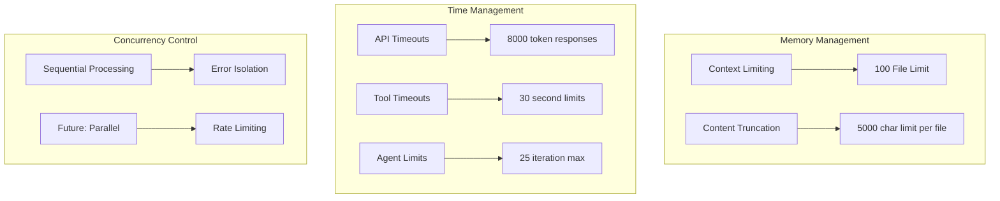

### Scalability Considerations

**Current Limitations**:
- Sequential repository processing
- No caching of analysis results
- Fixed resource limits (100 files, 5000 chars)

**Future Optimizations**:
- Parallel processing with rate limiting
- Git-hash based caching
- Dynamic resource allocation
- Incremental analysis

## Deployment Architecture

### Development Setup

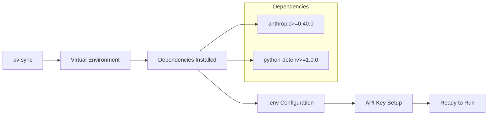

### Configuration Management

**Environment Variables**:
```bash
# Required
ANTHROPIC_API_KEY=sk-ant-api03-...

# Optional Configuration
SKILLS_BASE_PATH=/path/to/claude-toolkit/generated-skills
```

**Runtime Configuration**:
```python
DEFAULT_REPOS = [
    "/Users/mpaz/workspace/mcp-fleet",
    "/Users/mpaz/workspace/rishi",
]
```

## Monitoring and Observability

### Execution Tracking

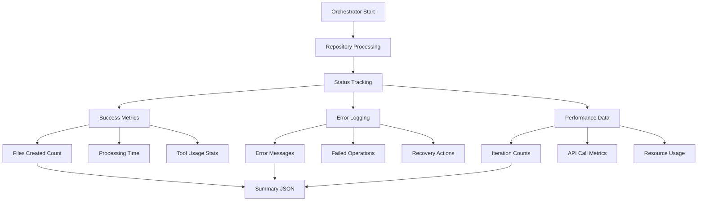

### Result Persistence

**Summary JSON Format**:
```json
{
  "repo": "project-name",
  "path": "/full/path/to/repo",
  "skill": "project-moc-generator", 
  "status": "success|error",
  "mode": "agent|simple",
  "iterations": 12,
  "files_created": ["docs/moc/README.md"],
  "files_modified": ["docs/moc/README.md"],
  "tool_uses_count": 23,
  "timestamp": "2025-11-20T10:30:00"
}
```

This architecture provides a solid foundation for AI-powered repository automation while maintaining flexibility for future enhancements and scaling requirements.