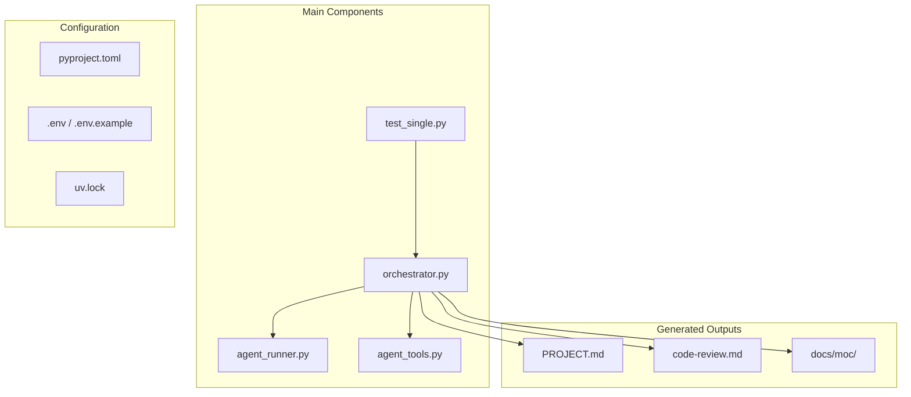
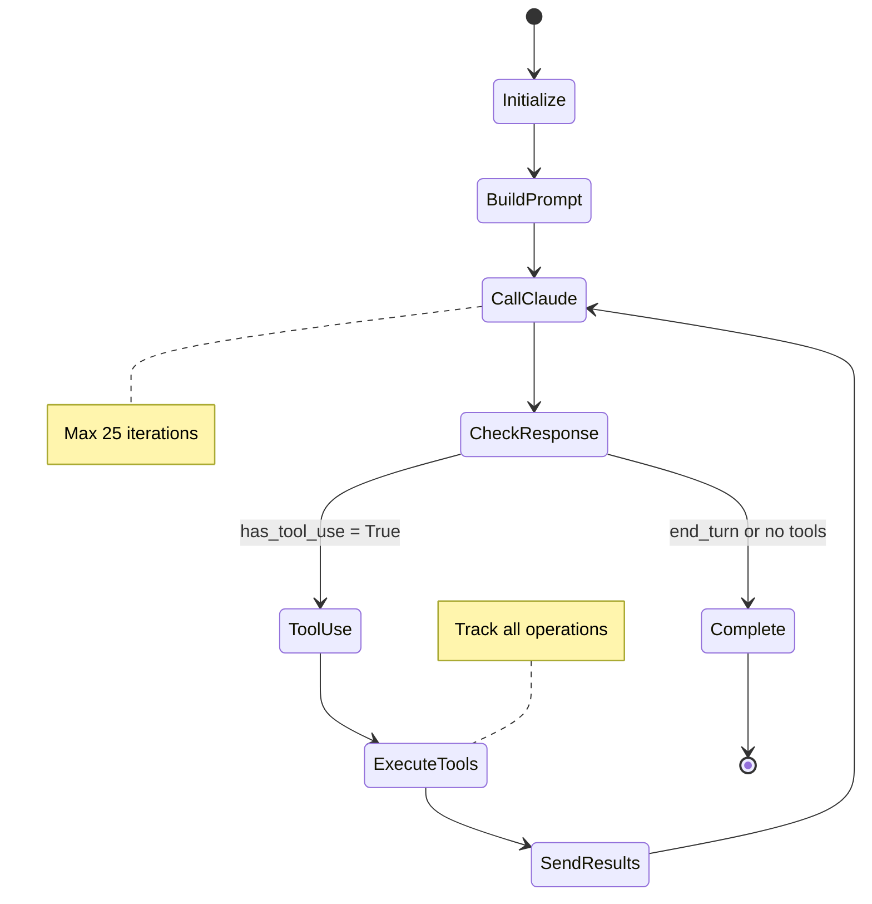
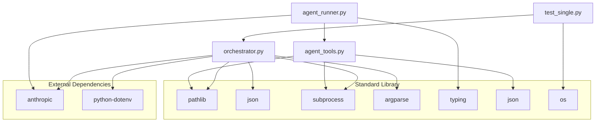
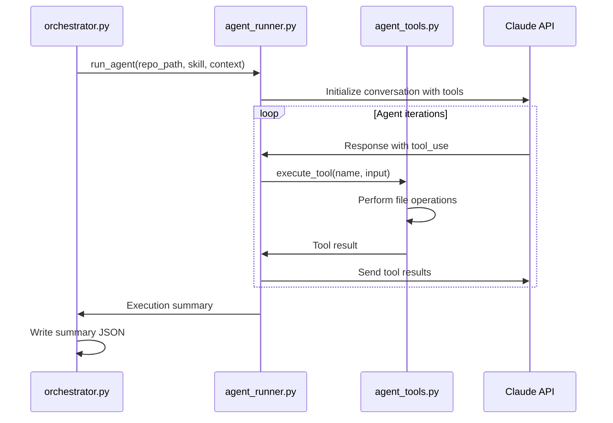

# Components Reference

This document provides detailed implementation documentation for each component of the Generic Orchestrator for Claude Skills, including code references, dependencies, and integration patterns.

## Core Components Overview



## Core Orchestrator Component

### File: `orchestrator.py`

**Role**: Main orchestration engine and CLI interface

**Size**: 450+ lines of Python

**Key Responsibilities**:
- Command-line interface and argument parsing
- Skill discovery and dynamic loading
- Repository context collection
- Batch processing coordination  
- Output file management
- Result tracking and persistence

#### Class Structure

```python
# No formal classes - functional design
# Key functions documented below
```

#### Key Functions

##### `main()` - CLI Entry Point
```python
def main():
    """Main orchestrator function"""
    # Arguments: --skill, --repos, --output, --list-skills, --agent, --simple
    # Coordinates entire execution flow
```

**Implementation Details**:
- Uses `argparse` for comprehensive CLI parsing
- Supports both default and runtime repository configuration
- Handles skill discovery and validation
- Manages execution mode selection (agent vs simple)
- Tracks results and generates summary JSON

**Dependencies**:
- `argparse`: Command-line interface
- `pathlib.Path`: File system operations
- `datetime`: Timestamping
- `json`: Result serialization

##### `load_skill(skill_name: str) -> dict`
```python
def load_skill(skill_name: str) -> dict:
    """Load a skill from the toolkit."""
    # Returns: {name, path, definition, template, metadata}
```

**Implementation Details**:
- Dynamically discovers skills from `SKILLS_BASE_PATH`
- Reads `SKILL.md` files with optional `template.md`
- Extracts metadata for output management
- Validates skill structure and content

**File Structure Expected**:
```
/path/to/claude-toolkit/generated-skills/
├── repo-summarizer/
│   ├── SKILL.md
│   └── template.md (optional)
├── code-reviewer/
│   └── SKILL.md
└── project-moc-generator/
    └── SKILL.md
```

##### `collect_repo_context(repo_path: Path) -> str`
```python
def collect_repo_context(repo_path: Path) -> str:
    """Collect relevant information about the repository for analysis."""
```

**Context Collection Strategy**:
1. **File Structure Discovery**:
   ```bash
   find . -type f -not -path "*/.*" -not -path "*/node_modules/*" \
          -not -path "*/__pycache__/*" -not -path "*/venv/*" \
          -not -path "*/.venv/*"
   ```

2. **Important Files Detection**:
   ```python
   important_files = ["README.md", "package.json", "pyproject.toml", 
                     "requirements.txt", "Cargo.toml", "go.mod", 
                     "pom.xml", "build.gradle"]
   ```

3. **Content Extraction**:
   - Limits file content to 5000 characters per file
   - Handles encoding errors gracefully
   - Provides comprehensive repository overview

##### `process_repo_with_skill()` - Repository Processing
```python
def process_repo_with_skill(repo_path: str, skill: dict, 
                          output_filename: str = None, 
                          use_agent: bool = True) -> dict:
```

**Processing Flow**:
1. Repository validation and existence check
2. Execution mode selection (agent vs simple)
3. Context collection and bundling
4. API execution (direct or agent-based)
5. Output file generation with skill-aware naming
6. Result tracking and metadata collection

**Output Management Logic**:
```python
# Priority order for output location:
# 1. User override (--output flag)
# 2. Skill metadata (from SKILL.md analysis)
# 3. Directory creation (for MOC-type skills)
# 4. Fallback naming (skill-name_output.md)
```

#### Configuration Management

**Environment Variables**:
```python
# Required
ANTHROPIC_API_KEY = os.getenv("ANTHROPIC_API_KEY")

# Configurable paths
SKILLS_BASE_PATH = "/Users/mpaz/workspace/claude-toolkit/generated-skills"
DEFAULT_REPOS = [
    "/Users/mpaz/workspace/mcp-fleet",
    "/Users/mpaz/workspace/rishi",
]
```

**API Client Configuration**:
```python
client = Anthropic(api_key=api_key)

# API calls use:
# - Model: "claude-sonnet-4-20250514" 
# - Max tokens: 8000
# - Temperature: Default (not specified)
```

#### Error Handling

**Repository Level**:
- Path existence validation
- Permission checking
- Graceful failure isolation (batch continues)

**API Level**:
- Network timeout handling
- Response format validation
- Token limit awareness

**File System Level**:
- Directory creation for complex outputs
- Write permission verification
- Encoding error handling

## Agent Runner Component

### File: `agent_runner.py`

**Role**: Autonomous agent execution with tool capabilities

**Size**: 130+ lines of Python

**Key Responsibilities**:
- Multi-turn conversation management
- Tool execution coordination
- Agent state tracking
- Resource limit enforcement
- Conversation history maintenance

#### Class Structure

```python
class AgentRunner:
    """Runs Claude agents with tool use capability."""
    
    def __init__(self, client: Anthropic, max_iterations: int = 25):
        self.client = client
        self.max_iterations = max_iterations
```

#### Key Methods

##### `run_agent()` - Main Agent Execution
```python
def run_agent(self, repo_path: str, skill: Dict[str, Any], 
              initial_context: str = "") -> Dict[str, Any]:
    """Run an agent with tool use capabilities."""
```

**Execution Loop**:


**Agent Loop Implementation**:
```python
while iteration < self.max_iterations:
    iteration += 1
    
    # Call Claude with tool access
    response = self.client.messages.create(
        model="claude-sonnet-4-20250514",
        max_tokens=8000,
        system=system_prompt,
        tools=tools,
        messages=messages
    )
    
    # Process tool uses if present
    for block in response.content:
        if block.type == "tool_use":
            result = tool_executor.execute_tool(block.name, block.input)
            # Track operations and continue conversation
```

##### System Prompt Construction
```python
def _build_system_prompt(self, skill: Dict[str, Any]) -> str:
    """Build system prompt for the agent."""
    return f"""You are an autonomous agent executing a skill from a developer's toolkit.

SKILL DEFINITION:
{skill['definition']}

You have access to tools to read, write, list, and search files in the repository.

IMPORTANT INSTRUCTIONS:
1. Use the tools to explore the repository and understand its structure
2. Follow the skill definition carefully to complete the task
3. Create all necessary files and directories as specified in the skill
4. When you are done, simply stop - do not ask for confirmation
5. Work autonomously - you have full authority to create and modify files

Be thorough and complete the entire task as defined in the skill."""
```

#### Agent State Tracking

**Tracked Metrics**:
```python
{
    "iterations": 12,               # Number of agent turns
    "files_created": ["docs/moc/README.md"],  # New files
    "files_modified": ["README.md"],           # Changed files
    "tool_uses": [                            # Complete tool log
        {
            "iteration": 3,
            "tool": "write_file",
            "input": {...},
            "result": {...}
        }
    ],
    "conversation_length": 24       # Total message count
}
```

#### Integration with Tool System

```python
# Tool executor instantiation
tool_executor = ToolExecutor(repo_path)
tools = get_tool_definitions()

# Tool result processing
for block in response.content:
    if block.type == "tool_use":
        result = tool_executor.execute_tool(block.name, block.input)
        
        # File operation tracking
        if block.name == "write_file" and "success" in result:
            files_created.append(block.input["path"])
```

## Tool System Component

### File: `agent_tools.py`

**Role**: File system tools and command execution for agents

**Size**: 200+ lines of Python

**Key Responsibilities**:
- Safe file system operations
- Command execution with timeouts
- Error handling and reporting
- Operation logging and tracking

#### Class Structure

```python
class ToolExecutor:
    """Executes tools on behalf of Claude agents within a repository context."""
    
    def __init__(self, repo_path: str):
        self.repo_path = Path(repo_path)
        self.working_directory = self.repo_path
```

#### Available Tools

##### `read_file` - File Reading
```python
def _read_file(self, tool_input: Dict[str, Any]) -> Dict[str, Any]:
    """Read a file from the repository."""
    # Features:
    # - UTF-8 encoding handling
    # - File existence validation
    # - Error message standardization
```

**Usage Example**:
```json
{
    "name": "read_file",
    "parameters": {
        "path": "src/main.py"
    }
}
```

##### `write_file` - File Creation/Modification
```python
def _write_file(self, tool_input: Dict[str, Any]) -> Dict[str, Any]:
    """Write content to a file in the repository."""
    # Features:
    # - Automatic directory creation (parents=True)
    # - UTF-8 encoding
    # - Success/error reporting
    # - Path safety validation
```

**Usage Example**:
```json
{
    "name": "write_file", 
    "parameters": {
        "path": "docs/new_document.md",
        "content": "# New Document\n\nContent here..."
    }
}
```

##### `list_files` - Directory Exploration
```python
def _list_files(self, tool_input: Dict[str, Any]) -> Dict[str, Any]:
    """List files in the repository matching a pattern."""
    # Features:
    # - Glob pattern support (*, *.py, **/*.md)
    # - Relative path output
    # - Result limiting (100 files max)
    # - Truncation indication
```

**Usage Examples**:
```json
// List all Python files
{
    "name": "list_files",
    "parameters": {
        "pattern": "*.py",
        "path": "src"
    }
}

// List all files recursively  
{
    "name": "list_files",
    "parameters": {
        "pattern": "**/*"
    }
}
```

##### `search_files` - Text Search
```python
def _search_files(self, tool_input: Dict[str, Any]) -> Dict[str, Any]:
    """Search for a pattern in files using grep."""
    # Features:
    # - Regex pattern support
    # - File list output (not content)
    # - Recursive search
    # - Timeout protection (30s)
```

**Usage Example**:
```json
{
    "name": "search_files",
    "parameters": {
        "pattern": "def main",
        "file_pattern": "*.py"
    }
}
```

##### `run_bash` - Command Execution
```python  
def _run_bash(self, tool_input: Dict[str, Any]) -> Dict[str, Any]:
    """Execute a bash command in the repository directory."""
    # Features:
    # - Working directory scoped to repository
    # - Stdout/stderr capture
    # - Return code reporting
    # - 30-second timeout limit
    # - Command injection prevention
```

**Usage Examples**:
```json
// Git operations
{
    "name": "run_bash",
    "parameters": {
        "command": "git log --oneline -10"
    }
}

// File statistics
{
    "name": "run_bash", 
    "parameters": {
        "command": "find . -name '*.py' | wc -l"
    }
}
```

#### Tool Security Features

**Path Validation**:
```python
# All file operations are scoped to repository root
file_path = self.repo_path / tool_input["path"]

# Prevents directory traversal
if not file_path.is_relative_to(self.repo_path):
    return {"error": "Path outside repository boundary"}
```

**Command Safety**:
```python
# All bash commands executed with:
subprocess.run(
    command,
    shell=True,
    cwd=self.repo_path,      # Scoped working directory
    capture_output=True,     # No direct I/O access
    text=True,
    timeout=30              # Hard timeout limit
)
```

**Error Handling**:
```python
try:
    # Tool operation
    return {"success": True, "result": result}
except Exception as e:
    return {"error": f"Operation failed: {str(e)}"}
```

#### Tool Definition Schema

```python
def get_tool_definitions() -> List[Dict[str, Any]]:
    """Get Anthropic API tool definitions for Claude."""
    return [
        {
            "name": "read_file",
            "description": "Read the contents of a file in the repository. Use this to examine existing files.",
            "input_schema": {
                "type": "object", 
                "properties": {
                    "path": {
                        "type": "string",
                        "description": "Relative path to the file within the repository"
                    }
                },
                "required": ["path"]
            }
        },
        # ... other tools
    ]
```

## Test Component

### File: `test_single.py`

**Role**: Single repository testing utility

**Size**: 40+ lines of Python

**Key Responsibilities**:
- API key validation
- Single repository testing
- Self-analysis capability
- Error reporting and debugging

#### Implementation

```python
def main():
    # API key validation
    if not os.environ.get("ANTHROPIC_API_KEY"):
        print("ERROR: ANTHROPIC_API_KEY environment variable not set")
        return 1
    
    # Self-testing on orchestrator repository
    test_repo = "/Users/mpaz/workspace/orchestrator"
    result = run_skill_on_repo(test_repo)
    
    # Result validation and reporting
    if result["status"] == "success":
        print(f"Success! Generated PROJECT.md")
        return 0
    else:
        print(f"Failed: {result.get('message', 'Unknown error')}")
        return 1
```

**Usage**:
```bash
uv run python test_single.py
```

## Configuration Components

### File: `pyproject.toml`

**Role**: Python project configuration and dependency management

```toml
[project]
name = "orchestrator"
version = "0.1.0"
description = "Simple orchestrator for running repo-summarizer skill across multiple repositories"
readme = "README.md"
requires-python = ">=3.12"
dependencies = [
    "anthropic>=0.40.0",
    "python-dotenv>=1.0.0",
]

[build-system]
requires = ["hatchling"]
build-backend = "hatchling.build"
```

**Key Configuration**:
- **Python Version**: 3.12+ requirement
- **Core Dependencies**: Minimal, focused set
- **Build System**: Modern hatchling backend
- **UV Support**: Native UV package manager integration

### File: `.env.example`

**Role**: Environment configuration template

```bash
# Anthropic API Key
# Get your API key from: https://console.anthropic.com/settings/keys
ANTHROPIC_API_KEY=your-api-key-here
```

**Security Features**:
- Template format prevents accidental key exposure
- Clear documentation for API key acquisition
- Simple single-variable configuration

### File: `uv.lock`

**Role**: Reproducible dependency locking

**Features**:
- Exact version pinning for all dependencies
- Transitive dependency resolution
- Cross-platform compatibility
- Development environment reproducibility

## Component Dependencies

### Dependency Graph



### Import Structure

**orchestrator.py imports**:
```python
import subprocess
import json
import os
import argparse
from pathlib import Path
from datetime import datetime
from anthropic import Anthropic
from dotenv import load_dotenv
from agent_runner import AgentRunner
```

**agent_runner.py imports**:
```python
from typing import Dict, Any, List
from pathlib import Path
from anthropic import Anthropic
from agent_tools import ToolExecutor, get_tool_definitions
import json
```

**agent_tools.py imports**:
```python
import subprocess
from pathlib import Path
from typing import Any, Dict, List
import json
```

## Integration Patterns

### Component Communication



### Error Propagation

```python
# Error handling hierarchy:
# 1. Tool level: Individual operation failures
# 2. Agent level: Conversation management errors  
# 3. Orchestrator level: Repository processing errors
# 4. CLI level: User-facing error messages

try:
    result = process_repo_with_skill(repo_path, skill, output_filename, use_agent)
    if result["status"] == "error":
        print(f"Failed: {result['repo']} - {result.get('message', 'Unknown error')}")
except Exception as e:
    print(f"Unexpected error processing {repo_path}: {e}")
```

### Data Flow Patterns

**Context Collection → Analysis → Output**:
```python
# 1. Context collection
context = collect_repo_context(repo_path)

# 2. Agent execution 
if use_agent:
    agent_runner = AgentRunner(client)
    result = agent_runner.run_agent(repo_path, skill, context)
else:
    output = run_skill_on_repo(repo_path, skill)

# 3. Output management
# File writing handled by agents or orchestrator
# Summary JSON generated by orchestrator
```

This component reference provides the detailed implementation knowledge needed to understand, modify, or extend the orchestrator system. Each component is designed with clear responsibilities and well-defined interfaces for maintainability and extensibility.