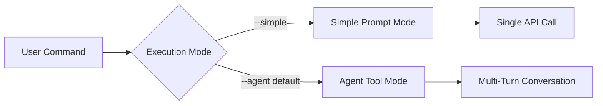

# Architectural Decision Records

This document captures the key architectural and technical decisions made during the development of the Generic Orchestrator for Claude Skills, including the reasoning behind choices and alternatives considered but not implemented.

## Decision Summary

| Decision | Status | Impact | Date |
|----------|--------|--------|------|
| [Single-File Orchestrator](#decision-001-single-file-orchestrator-design) | ✅ Implemented | High | Early Development |
| [Dual Execution Modes](#decision-002-dual-execution-modes) | ✅ Implemented | High | Mid Development |  
| [Skill-Agnostic Architecture](#decision-003-skill-agnostic-architecture) | ✅ Implemented | High | Early Development |
| [UV Package Manager](#decision-004-uv-package-manager-adoption) | ✅ Implemented | Medium | Early Development |
| [Sequential Processing](#decision-005-sequential-repository-processing) | ✅ Implemented | Medium | Early Development |
| [Tool-Based Agent System](#decision-006-tool-based-agent-system) | ✅ Implemented | High | Mid Development |
| [Claude Sonnet 4 Selection](#decision-007-claude-sonnet-4-model-selection) | ✅ Implemented | Medium | Early Development |

## Decision 001: Single-File Orchestrator Design

**Status**: ✅ Implemented

**Context**: 
The initial orchestrator needed to be simple to deploy and understand while providing comprehensive functionality for running skills across multiple repositories.

**Decision**: 
Implement the core orchestrator as a single Python file (`orchestrator.py`) with all main functionality contained within it, rather than creating a multi-module package structure.

**Reasoning**:

✅ **Chosen Approach - Single File**:
- **Deployment Simplicity**: Single file can be copied and run anywhere
- **Dependency Minimization**: No complex import structures or package management
- **Rapid Development**: All logic in one place for quick iteration
- **Clear Data Flow**: Function-to-function calls are transparent
- **Debugging Ease**: All code visible in one location

❌ **Alternatives Considered**:

**Multi-Module Package Structure**:
```
orchestrator/
├── __init__.py
├── cli.py
├── skill_loader.py
├── context_collector.py
├── api_client.py
└── output_manager.py
```
- **Rejected Because**: Adds complexity for a tool that should be simple to understand and deploy
- **Trade-offs**: Better separation of concerns but harder to distribute and debug

**Class-Based Architecture**:
```python
class Orchestrator:
    def __init__(self):
        self.client = AnthropicClient()
        self.skill_loader = SkillLoader()
        # ...
```
- **Rejected Because**: Adds OOP overhead for what is essentially a pipeline of functions
- **Trade-offs**: More "proper" software engineering but unnecessary abstraction

**Implications**:
- ✅ Easy deployment and distribution
- ✅ Rapid development and iteration
- ❌ May become unwieldy as features grow
- ❌ Less modular for testing individual components

**Current Assessment**: Correct choice for current scope. Consider refactoring if file exceeds ~1000 lines.

## Decision 002: Dual Execution Modes

**Status**: ✅ Implemented

**Context**:
Skills vary in complexity - some need simple prompt-based execution while others benefit from multi-turn agent interactions with tool access.

**Decision**:
Implement both simple mode (single API call) and agent mode (multi-turn with tools) execution paths, with agent mode as the default.

**Reasoning**:

✅ **Chosen Approach - Dual Modes**:


**Simple Mode Benefits**:
- Fast execution for straightforward tasks
- Lower token usage
- Predictable single API call
- Easier to debug and understand

**Agent Mode Benefits**:
- Can explore repository structure autonomously  
- Multi-step problem solving capability
- File system access for complex operations
- Self-correcting behavior

❌ **Alternatives Considered**:

**Agent Mode Only**:
- **Rejected Because**: Overkill for simple documentation generation
- **Trade-offs**: More powerful but unnecessary overhead for basic skills

**Simple Mode Only**: 
- **Rejected Because**: Insufficient for complex skills like `project-moc-generator`
- **Trade-offs**: Simpler implementation but limited capability

**Skill-Determined Mode**:
```python
# Mode determined by skill metadata
if skill.metadata.get("requires_tools"):
    use_agent_mode = True
```
- **Rejected Because**: Removes user control and adds complexity to skill definitions
- **Trade-offs**: More automatic but less flexible

**Implementation Details**:
```python
# CLI interface
parser.add_argument("--agent", "-a", action="store_true", default=True)
parser.add_argument("--simple", action="store_true")

# Execution logic
use_agent = not args.simple
result = process_repo_with_skill(repo_path, skill, output_filename, use_agent)
```

**Implications**:
- ✅ Flexibility for different skill types
- ✅ User control over execution style
- ❌ Two code paths to maintain
- ❌ Potential confusion about which mode to use

## Decision 003: Skill-Agnostic Architecture

**Status**: ✅ Implemented

**Context**:
The orchestrator needed to work with any skill from the Claude toolkit without requiring code changes for new skills.

**Decision**:
Implement dynamic skill loading from standardized `SKILL.md` files with metadata extraction for output management.

**Reasoning**:

✅ **Chosen Approach - Dynamic Loading**:
```python
def load_skill(skill_name: str) -> dict:
    """Load skill from SKILL.md with optional template.md"""
    skill_path = Path(SKILLS_BASE_PATH) / skill_name
    # Load SKILL.md content
    # Extract metadata for output management
    # Include template if present
```

**Benefits**:
- **Extensibility**: New skills require no orchestrator changes
- **Maintainability**: Skill logic separated from execution engine
- **Flexibility**: Skills define their own requirements and outputs
- **Ecosystem Growth**: Easy to add skills to toolkit

❌ **Alternatives Considered**:

**Hardcoded Skill Support**:
```python
if skill_name == "repo-summarizer":
    return generate_project_md(repo_context)
elif skill_name == "code-reviewer":
    return generate_code_review(repo_context)
# ...
```
- **Rejected Because**: Not scalable, requires code changes for new skills
- **Trade-offs**: More control but extremely inflexible

**Plugin Architecture with Python Modules**:
```python
# skills/repo_summarizer.py
class RepoSummarizerSkill:
    def execute(self, context):
        # Implementation
```
- **Rejected Because**: Adds complexity and security concerns
- **Trade-offs**: More powerful but harder to manage and potentially unsafe

**Configuration-Based Skills**:
```yaml
# skills.yaml
repo-summarizer:
  prompt: "Generate PROJECT.md for: {context}"
  output: "PROJECT.md"
```
- **Rejected Because**: Too limiting for complex skills
- **Trade-offs**: Simpler but insufficient for advanced use cases

**Metadata Extraction Strategy**:
```python
def extract_skill_metadata(skill_definition: str) -> dict:
    # Pattern matching for output expectations
    if "docs/moc/" in skill_definition.lower():
        metadata["output_location"] = "docs/moc"
        metadata["creates_directory"] = True
    
    if "project.md" in skill_definition.lower():
        metadata["output_filename"] = "PROJECT.md"
```

**Implications**:
- ✅ Easy skill ecosystem growth
- ✅ No code changes for new skills  
- ❌ Less type safety and validation
- ❌ Metadata extraction can be brittle

## Decision 004: UV Package Manager Adoption

**Status**: ✅ Implemented

**Context**:
Python dependency management needed to be fast, reliable, and modern for development productivity.

**Decision**:
Use UV as the primary package manager instead of pip, poetry, or pipenv.

**Reasoning**:

✅ **Chosen Approach - UV**:
```bash
# Install and setup
uv sync

# Run commands
uv run python orchestrator.py
```

**UV Benefits**:
- **Speed**: 10-100x faster than pip for dependency resolution
- **Reliability**: Excellent dependency conflict resolution
- **Modern**: Built for Python 3.8+ with modern packaging standards
- **Simple**: Single tool for virtual environments and dependencies
- **Lock Files**: Reproducible builds with `uv.lock`

❌ **Alternatives Considered**:

**pip + requirements.txt**:
```bash
pip install -r requirements.txt
```
- **Rejected Because**: Slow, poor dependency resolution, no lock files
- **Trade-offs**: Universal compatibility but poor developer experience

**Poetry**:
```toml
[tool.poetry.dependencies]
python = "^3.12"
anthropic = "^0.40.0"
```
- **Rejected Because**: Slower than UV, more complex configuration
- **Trade-offs**: Good dependency management but overhead for simple project

**pipenv**:
```bash
pipenv install anthropic python-dotenv
```
- **Rejected Because**: Performance issues, maintenance concerns
- **Trade-offs**: Good virtual environment management but slow

**Configuration**:
```toml
# pyproject.toml
[project]
dependencies = [
    "anthropic>=0.40.0",
    "python-dotenv>=1.0.0",
]

[tool.uv]
dev-dependencies = []
```

**Implications**:
- ✅ Excellent developer experience
- ✅ Fast dependency operations
- ❌ Less universal than pip (though growing adoption)
- ❌ Relatively new tool (potential stability concerns)

## Decision 005: Sequential Repository Processing

**Status**: ✅ Implemented (with parallel processing planned)

**Context**:
The orchestrator processes multiple repositories and needed to balance simplicity, reliability, and performance.

**Decision**:
Implement sequential processing initially, with parallel processing as a future enhancement.

**Reasoning**:

✅ **Chosen Approach - Sequential**:
```python
results = []
for repo_path in repos:
    result = process_repo_with_skill(repo_path, skill, output_filename, use_agent)
    results.append(result)
    # Print progress after each repo
```

**Sequential Benefits**:
- **Simplicity**: Straightforward implementation and debugging
- **Reliability**: No race conditions or resource contention
- **API Respect**: Avoids overwhelming Claude API with concurrent calls
- **Error Isolation**: Repository failures don't affect others
- **Progress Visibility**: Clear per-repository progress reporting

❌ **Alternatives Considered**:

**Parallel Processing with asyncio**:
```python
async def process_repos_parallel(repos, skill, max_concurrent=3):
    semaphore = asyncio.Semaphore(max_concurrent)
    
    async def process_single(repo):
        async with semaphore:
            return await process_repo_async(repo, skill)
    
    tasks = [process_single(repo) for repo in repos]
    return await asyncio.gather(*tasks)
```
- **Rejected for V1 Because**: Added complexity, potential API rate limiting issues
- **Planned for Future**: Will implement with rate limiting

**Thread-Based Parallel Processing**:
```python
from concurrent.futures import ThreadPoolExecutor

with ThreadPoolExecutor(max_workers=3) as executor:
    results = list(executor.map(lambda repo: process_repo_with_skill(repo, skill), repos))
```
- **Rejected Because**: Threading complexity, potential resource contention
- **Trade-offs**: Faster but more complex error handling

**Batch API Calls**:
```python
# Process multiple repositories in single API call
contexts = [collect_repo_context(repo) for repo in repos]
batch_prompt = build_batch_prompt(contexts, skill)
```
- **Rejected Because**: Less granular control, harder error handling
- **Trade-offs**: Fewer API calls but less flexibility

**Future Enhancement Plan**:
```python
# Planned implementation
async def process_repos_with_rate_limiting(repos, skill, max_concurrent=2):
    """Process repositories in parallel with rate limiting."""
    # Rate limiter to respect API limits
    # Progress tracking for user feedback
    # Graceful error handling per repository
```

**Implications**:
- ✅ Reliable and predictable execution
- ✅ Easy to debug and understand
- ❌ Slower for large repository sets
- ❌ Underutilizes available resources

## Decision 006: Tool-Based Agent System

**Status**: ✅ Implemented

**Context**:
Complex skills like `project-moc-generator` need to explore repository structure, read files, and create multiple output files autonomously.

**Decision**:
Implement a comprehensive tool system that gives agents file system access and command execution capabilities.

**Reasoning**:

✅ **Chosen Approach - Rich Tool System**:
```python
# Available tools
tools = [
    "read_file",     # Read repository files
    "write_file",    # Create/modify files
    "list_files",    # Directory exploration
    "search_files",  # Grep-based search
    "run_bash"       # Command execution
]
```

**Tool System Benefits**:
- **Autonomy**: Agents can explore and understand repositories independently
- **Flexibility**: Can handle complex multi-file tasks
- **Self-Correction**: Agents can verify their work and make adjustments
- **Rich Analysis**: Can discover patterns and relationships in code

❌ **Alternatives Considered**:

**Prompt-Only Approach**:
```python
# Single large prompt with all repository context
prompt = f"""
Repository Structure: {file_list}
README.md: {readme_content}
Package Files: {manifests}

Generate project documentation based on this information.
"""
```
- **Rejected Because**: Token limits, loss of interactivity, less accurate analysis
- **Trade-offs**: Simpler but severely limited capability

**Limited Tool Set (read-only)**:
```python
tools = ["read_file", "list_files"]  # No write capabilities
```
- **Rejected Because**: Insufficient for skills that need to create multiple files
- **Trade-offs**: Safer but too restrictive for complex tasks

**External Script Execution**:
```python
# Generate script and execute it
script = agent.generate_analysis_script()
subprocess.run([script], shell=True)
```
- **Rejected Because**: Security risks, harder to control and monitor
- **Trade-offs**: Very powerful but potentially dangerous

**Safety Measures Implemented**:
```python
class ToolExecutor:
    def __init__(self, repo_path: str):
        self.repo_path = Path(repo_path)  # Scope all operations to repository
    
    def execute_tool(self, tool_name: str, tool_input: Dict):
        # Timeout limits on all operations
        # Path validation to prevent directory traversal
        # Error handling and safe failure modes
```

**Tool Implementation Example**:
```python
def _write_file(self, tool_input: Dict[str, Any]) -> Dict[str, Any]:
    file_path = self.repo_path / tool_input["path"]
    
    # Security: Ensure path is within repository
    if not file_path.is_relative_to(self.repo_path):
        return {"error": "Path outside repository boundary"}
    
    # Create directories as needed
    file_path.parent.mkdir(parents=True, exist_ok=True)
    
    try:
        with open(file_path, 'w', encoding='utf-8') as f:
            f.write(tool_input["content"])
        return {"success": True, "path": str(file_path)}
    except Exception as e:
        return {"error": f"Failed to write file: {str(e)}"}
```

**Implications**:
- ✅ Enables complex autonomous tasks
- ✅ Rich repository analysis capabilities
- ❌ More complex security considerations
- ❌ Potential for unintended file modifications

## Decision 007: Claude Sonnet 4 Model Selection

**Status**: ✅ Implemented

**Context**:
The orchestrator needed an AI model capable of sophisticated code analysis, technical writing, and tool use.

**Decision**:
Use Claude Sonnet 4 (`claude-sonnet-4-20250514`) as the primary model for all skills.

**Reasoning**:

✅ **Chosen Approach - Claude Sonnet 4**:
```python
response = client.messages.create(
    model="claude-sonnet-4-20250514",
    max_tokens=8000,
    system=system_prompt,
    tools=tools,
    messages=messages
)
```

**Claude Sonnet 4 Benefits**:
- **Code Understanding**: Excellent at analyzing repository structure and patterns
- **Technical Writing**: High-quality documentation generation
- **Tool Use**: Sophisticated multi-turn tool interactions
- **Context Handling**: Good with large repository contexts
- **Instruction Following**: Reliable adherence to skill definitions

❌ **Alternatives Considered**:

**Claude Haiku (Faster/Cheaper)**:
```python
model="claude-3-haiku-20240307"
```
- **Rejected Because**: Lower quality for complex technical analysis
- **Trade-offs**: Faster and cheaper but insufficient quality for professional output

**Claude Opus (Highest Quality)**:
```python
model="claude-3-opus-20240229" 
```
- **Rejected Because**: Slower and more expensive without significant quality improvement for this use case
- **Trade-offs**: Highest quality but diminishing returns for documentation tasks

**GPT-4 (OpenAI)**:
```python
# Hypothetical implementation
openai.ChatCompletion.create(
    model="gpt-4",
    messages=messages
)
```
- **Rejected Because**: Less consistent tool use, weaker technical writing for documentation
- **Trade-offs**: Good general capability but Claude superiority in code analysis

**Local Models (Ollama, etc.)**:
```python
# Hypothetical local model usage
local_client.generate(prompt, model="codellama:13b")
```
- **Rejected Because**: Insufficient quality for professional documentation, no tool use capability
- **Trade-offs**: Privacy and cost benefits but inadequate capability

**Model Configuration Rationale**:
```python
max_tokens=8000  # Sufficient for comprehensive documentation
# No temperature specified - using default for balanced creativity/consistency
# System prompts tailored for each skill
# Tool definitions comprehensive for repository operations
```

**Implications**:
- ✅ High-quality technical output
- ✅ Reliable tool use capabilities
- ❌ Higher cost than smaller models
- ❌ Dependency on Anthropic API availability

## Cross-Cutting Decisions

### Configuration Management Philosophy

**Decision**: Environment-based secrets, code-based defaults
```python
# Secure
ANTHROPIC_API_KEY = os.getenv("ANTHROPIC_API_KEY")

# Configurable but with defaults
DEFAULT_REPOS = [
    "/Users/mpaz/workspace/mcp-fleet",
    "/Users/mpaz/workspace/rishi",
]
```

**Reasoning**: Balances security (no secrets in code) with usability (sensible defaults).

### Error Handling Strategy

**Decision**: Graceful degradation with detailed logging
```python
try:
    result = process_repo_with_skill(repo_path, skill, output_filename, use_agent)
    results.append(result)
except Exception as e:
    # Log error but continue with other repositories
    results.append({
        "repo": repo_name,
        "status": "error", 
        "message": str(e)
    })
```

**Reasoning**: Repository failures shouldn't stop batch processing; detailed error information aids debugging.

### API Design Decisions

**Decision**: Return structured dictionaries, not exceptions
```python
return {
    "repo": repo_name,
    "status": "success|error",
    "output_file": str(output_file),
    "timestamp": datetime.now().isoformat()
}
```

**Reasoning**: Consistent result format enables easy batch processing and summary generation.

## Future Decision Points

### Decisions Under Consideration 🤔

**Parallel Processing Implementation**:
- How many concurrent repositories to process?
- What rate limiting strategy for API calls?
- How to handle progress reporting in parallel mode?

**Skill Validation System**:
- Should skills have schema validation?
- How to handle skill compatibility with orchestrator versions?
- What metadata should be required vs optional?

**Output Format Standardization**:
- Should all skills follow consistent output patterns?
- How to handle skills that create multiple files?
- What metadata should be included in generated files?

**Caching Strategy**:
- Should repository analysis be cached based on git commit hash?
- How to handle cache invalidation?
- What cache storage format (JSON, SQLite, etc.)?

These architectural decisions have shaped the orchestrator into a flexible, powerful tool for repository automation while maintaining simplicity and reliability. The modular decision-making approach allows for future evolution as requirements change and new use cases emerge.