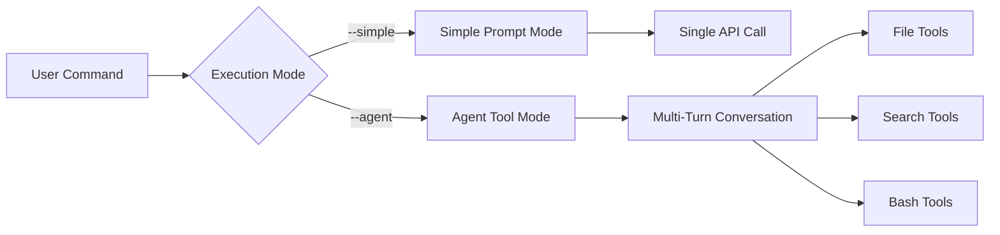

# Features Catalog

This document catalogs all implemented features of the Generic Orchestrator for Claude Skills, organized by functional area with implementation details and usage examples.

## Core Execution Engine

### Skill-Agnostic Architecture ✅

**Implementation**: [`orchestrator.py:load_skill()`](../../orchestrator.py)

The orchestrator can execute any skill from your Claude toolkit without modification. Skills are dynamically loaded from `SKILL.md` files with optional template support.

```python
# Automatic skill discovery
skill = load_skill("project-moc-generator")
# Returns: {name, path, definition, template, metadata}
```

**Supported Skills** (12+ available):
- `repo-summarizer`: Generate PROJECT.md portfolio documents
- `code-reviewer`: Comprehensive code analysis
- `project-moc-generator`: Map of Content documentation
- `technical-decision`: Architecture decision records
- `commit-helper`: Commit message assistance
- `spike-driven-dev`: Development spike guidance

### Dual Execution Modes ✅

**Simple Mode** (Legacy):
```bash
uv run python orchestrator.py --simple --skill repo-summarizer
```

**Agent Mode** (Default):
```bash  
uv run python orchestrator.py --agent --skill project-moc-generator
```

**Agent Mode Features**:
- Multi-iteration problem solving
- File system tool access (read, write, search, bash)
- Autonomous decision making
- Complex analysis capabilities



## Repository Processing

### Batch Repository Analysis ✅

**Implementation**: [`orchestrator.py:main()`](../../orchestrator.py)

Process multiple repositories in a single execution with comprehensive tracking.

```bash
# Process multiple repositories
uv run python orchestrator.py --repos repo1/ repo2/ repo3/ --skill code-reviewer
```

**Features**:
- Sequential processing with status tracking  
- Per-repository output files
- Centralized execution summary
- Error isolation (failed repos don't stop batch)

### Rich Context Collection ✅

**Implementation**: [`orchestrator.py:collect_repo_context()`](../../orchestrator.py)

Automatically extracts comprehensive repository metadata for analysis.

**Collected Information**:
- **File Structure**: Up to 100 files (filtered for relevance)
- **Documentation**: README.md content extraction
- **Package Manifests**: pyproject.toml, package.json, requirements.txt, Cargo.toml, go.mod, pom.xml, build.gradle
- **Repository Metadata**: Name, path, basic statistics

**Context Filtering**:
```bash
# Exclusions applied automatically
find . -type f -not -path "*/.*" -not -path "*/node_modules/*" \
    -not -path "*/__pycache__/*" -not -path "*/venv/*" -not -path "*/.venv/*"
```

### Intelligent Output Management ✅

**Implementation**: [`orchestrator.py:process_repo_with_skill()`](../../orchestrator.py)

Skill-aware output handling with multiple naming strategies.

**Output Strategies**:
1. **User Override**: `--output custom_name.md`
2. **Skill Metadata**: Based on skill definition
3. **Directory Creation**: For skills like `project-moc-generator`
4. **Fallback Naming**: `{skill-name}_output.md`

**Example Output Locations**:
- `repo-summarizer` → `PROJECT.md`
- `project-moc-generator` → `docs/moc/README.md`
- `code-reviewer` → `code-review.md`

## CLI Interface

### Comprehensive Argument Parsing ✅

**Implementation**: [`orchestrator.py:main()`](../../orchestrator.py)

Full-featured command-line interface with extensive options.

**Available Arguments**:
```bash
--skill, -s          Skill name to execute
--repos, -r          Repository paths (space-separated)  
--output, -o         Custom output filename
--list-skills        List all available skills
--agent, -a          Run as autonomous agent (default)
--simple             Run in simple prompt mode
```

**Usage Examples**:
```bash
# List available skills
uv run python orchestrator.py --list-skills

# Default behavior (repo-summarizer on default repos)
uv run python orchestrator.py

# Specific skill and repositories
uv run python orchestrator.py -s code-reviewer -r /path/repo1 /path/repo2

# Custom output with simple mode
uv run python orchestrator.py --simple -s technical-decision -o decisions.md
```

### Skill Discovery System ✅

**Implementation**: [`orchestrator.py:list_available_skills()`](../../orchestrator.py)

Automatic discovery of skills from the Claude toolkit directory.

```bash
$ uv run python orchestrator.py --list-skills

Available Skills:
============================================================
  - code-reviewer
  - commit-helper  
  - project-moc-generator
  - repo-summarizer
  - spike-driven-dev
  - technical-decision
  # ... and more

Total: 12 skills
============================================================
```

## Agent Tool System

### File System Operations ✅

**Implementation**: [`agent_tools.py:ToolExecutor`](../../agent_tools.py)

Comprehensive file system access for autonomous agents.

**Available Tools**:

**read_file**: Read file contents
```python
{"name": "read_file", "parameters": {"path": "src/main.py"}}
```

**write_file**: Create or overwrite files (creates directories)
```python  
{"name": "write_file", "parameters": {
    "path": "docs/new_doc.md",
    "content": "# Documentation\n..."
}}
```

**list_files**: Directory exploration with glob patterns
```python
{"name": "list_files", "parameters": {
    "path": "src", 
    "pattern": "*.py"
}}
```

**search_files**: Grep-based text search
```python
{"name": "search_files", "parameters": {
    "pattern": "def main",
    "file_pattern": "*.py"  
}}
```

**run_bash**: Execute shell commands
```python
{"name": "run_bash", "parameters": {
    "command": "git log --oneline -10"
}}
```

### Agent Execution Tracking ✅

**Implementation**: [`agent_runner.py:AgentRunner`](../../agent_runner.py)

Advanced execution monitoring for autonomous agents.

**Tracking Features**:
- **Iteration Count**: Number of agent turns
- **Tool Usage**: Complete tool execution log
- **File Operations**: Files created/modified tracking
- **Conversation History**: Full message thread
- **Resource Limits**: Max iterations (default: 25)

**Example Output**:
```json
{
  "iterations": 8,
  "files_created": ["docs/moc/README.md", "docs/moc/features.md"],
  "files_modified": ["docs/moc/README.md"],
  "tool_uses_count": 15,
  "conversation_length": 16
}
```

## Configuration and Environment

### Environment-Based Configuration ✅

**Implementation**: [`orchestrator.py`](../../orchestrator.py) with `python-dotenv`

Secure API key management and flexible configuration.

**Required Environment**:
```bash
# .env file
ANTHROPIC_API_KEY=sk-ant-api03-your-key-here
```

**Configuration Options**:
- **SKILLS_BASE_PATH**: Claude toolkit location
- **DEFAULT_REPOS**: Default repository list
- **API Client**: Claude Sonnet 4 model selection

### Repository Path Management ✅

**Default Repository Support**:
```python
DEFAULT_REPOS = [
    "/Users/mpaz/workspace/mcp-fleet",
    "/Users/mpaz/workspace/rishi",
]
```

**Runtime Override**:
```bash
# Override defaults
uv run python orchestrator.py --repos /custom/path1 /custom/path2
```

## Output and Tracking

### Result Persistence ✅

**Implementation**: [`orchestrator.py:main()`](../../orchestrator.py)

Comprehensive execution tracking with JSON summaries.

**Output Files**:
- **Per-Repository**: Skill-specific output files in each repository
- **Summary JSON**: `~/orchestrator_{skill-name}_results.json`

**Summary Format**:
```json
{
  "repo": "orchestrator",
  "path": "/Users/mpaz/workspace/orchestrator", 
  "skill": "project-moc-generator",
  "status": "success",
  "mode": "agent",
  "iterations": 12,
  "files_created": ["docs/moc/README.md", "docs/moc/features.md"],
  "tool_uses_count": 23,
  "timestamp": "2025-11-20T10:30:00"
}
```

### Error Handling and Validation ✅

**Repository Validation**:
- Path existence checking
- Access permission validation
- Graceful error isolation

**API Error Handling**:
- Network timeout management (30s)
- Rate limiting considerations
- Response format validation

**Tool Execution Safety**:
- Command timeout limits
- File system boundary enforcement  
- Error result capture

## Testing and Quality

### Single Repository Testing ✅

**Implementation**: [`test_single.py`](../../test_single.py)

Dedicated testing utility for individual repository validation.

```bash
# Test orchestrator on itself
uv run python test_single.py
```

**Test Features**:
- API key validation
- Self-analysis capability
- Error reporting
- Success/failure status

### Dependency Management ✅

**Implementation**: [`pyproject.toml`](../../pyproject.toml) with UV

Modern Python dependency management with reproducible builds.

**Core Dependencies**:
- `anthropic>=0.40.0`: Claude API client
- `python-dotenv>=1.0.0`: Environment management

**Development Features**:
- Dependency locking with `uv.lock`
- Python 3.12+ requirement
- Clean virtual environment management

## Feature Roadmap

### Planned Enhancements 🚧

**Performance Improvements**:
- Parallel repository processing with rate limiting
- Incremental analysis based on git commit hashes
- Caching system for repeated analyses

**Integration Enhancements**:
- GitHub API integration for organization scanning
- tmux session management for long-running tasks
- Custom skill templates per repository type

**User Experience**:
- Web dashboard for results visualization
- Progress tracking with status updates
- Interactive skill selection and configuration

**Advanced Features**:
- Quality metrics and documentation scoring
- Repository change detection and alerts
- Integration with project management tools

---

## Usage Patterns

### Portfolio Management Workflow
```bash
# Generate PROJECT.md for all repositories
uv run python orchestrator.py --skill repo-summarizer --repos \
  ~/projects/app1 ~/projects/app2 ~/projects/lib1
```

### Code Quality Assessment
```bash
# Review multiple repositories
uv run python orchestrator.py --skill code-reviewer --repos \
  ~/work/service-a ~/work/service-b
```

### Documentation Generation
```bash  
# Create comprehensive documentation
uv run python orchestrator.py --skill project-moc-generator --repos ~/project
```

### Technical Decision Documentation
```bash
# Document architectural decisions
uv run python orchestrator.py --skill technical-decision --repos ~/microservices/*
```

This feature catalog represents the current implementation state of the orchestrator. All listed features are production-ready and actively used for repository automation workflows.